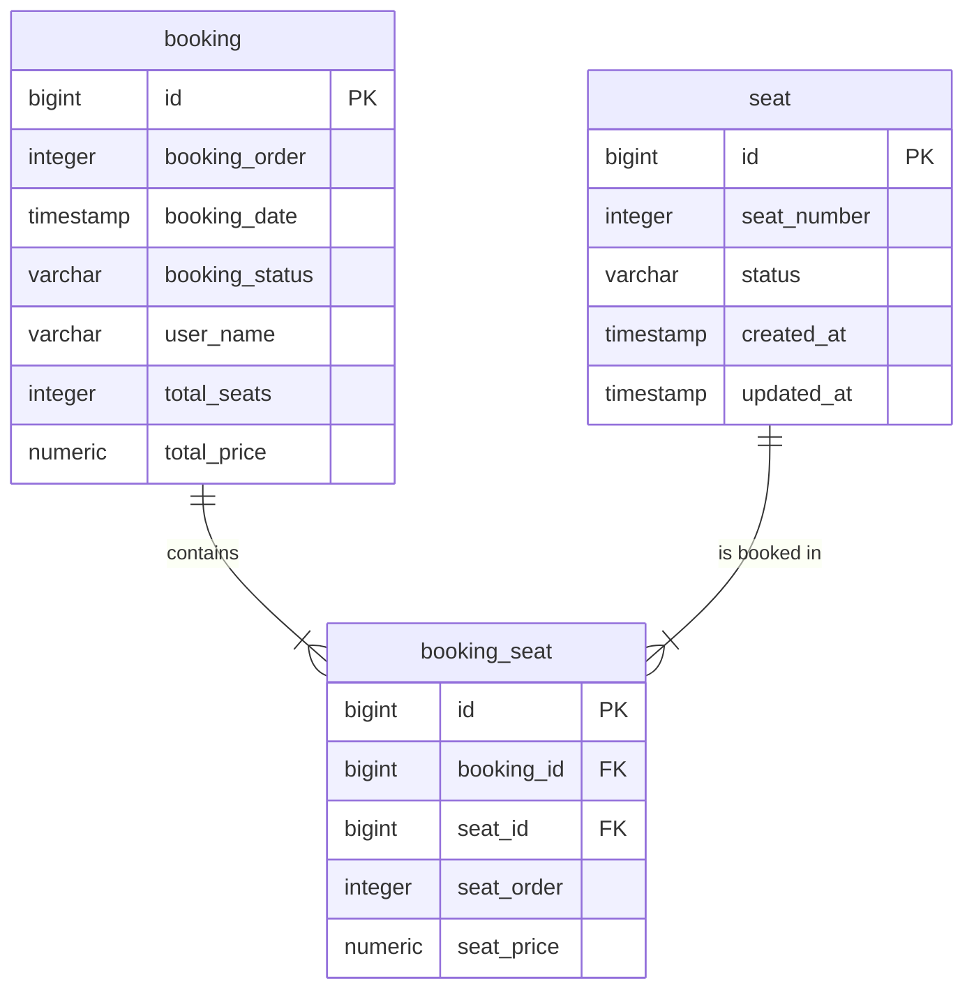

# Dynamic Event Ticketing System

A full-stack event ticketing system with dynamic pricing based on booking order. Built with Spring Boot, PostgreSQL, React, and Tailwind CSS.

## 🎯 Features

- **100 Seats Management**: Visual 10x10 grid of seats
- **Dynamic Pricing**: Tier-based pricing based on booking order (not seat number)
  - Seats 1-50: $50 each
  - Seats 51-80: $75 each
  - Seats 81-100: $100 each
- **Real-time Updates**: Seat availability updates in real-time
- **Concurrent Booking**: Thread-safe booking with pessimistic locking
- **PostgreSQL Database**: Persistent storage with proper relationships
- **Docker Support**: Easy database setup with Docker Compose

## 🏗️ Architecture

### Backend (Spring Boot)
- **Framework**: Spring Boot 3.2.2
- **Database**: PostgreSQL 15
- **ORM**: Spring Data JPA / Hibernate
- **Build Tool**: Maven
- **Java Version**: 17

### Frontend (React)
- **Framework**: React 18
- **Language**: TypeScript
- **Build Tool**: Vite
- **Styling**: Tailwind CSS v4
- **HTTP Client**: Axios

### Database Schema
> **Note**: This system is designed as a **Single Event Architecture**, so there is no explicit `Event` table. All seats and bookings are scoped to a single global event context.

- **Seat**: Individual seats (1-100)
- **Booking**: Booking transactions
- **BookingSeat**: Join table with pricing information



## 📋 Prerequisites

- Java 17 or higher
- Maven 3.6+
- Docker and Docker Compose
- Node.js 18+ (for frontend)

## 🚀 Getting Started

### 1. Start PostgreSQL Database

```bash
# From project root directory
docker-compose up -d

# Verify database is running
docker ps
```

### 2. Run Backend

```bash
cd backend

# Download dependencies
mvn clean install

# Run the application
mvn spring-boot:run
```

The backend will start on **http://localhost:8080**

### 3. Initialize Event

```bash
# Initialize 100 seats
curl -X POST http://localhost:8080/api/initialize
```

### 4. Run Frontend

```bash
cd frontend

# Install dependencies
npm install

# Run development server
npm run dev
```

The frontend will start on **http://localhost:5173**

## 📡 API Endpoints

### 1. Initialize Event
```http
POST /api/initialize
```

**Response:**
```json
{
  "success": "true",
  "message": "Event initialized with 100 seats"
}
```

### 2. Get All Seats
```http
GET /api/seats
```

**Response:**
```json
[
  {
    "id": 1,
    "seatNumber": 1,
    "status": "AVAILABLE",
    "createdAt": "2026-02-08T19:00:00",
    "updatedAt": "2026-02-08T19:00:00"
  },
  ...
]
```

### 3. Book Seats
```http
POST /api/book
Content-Type: application/json

{
  "seatIds": [1, 2, 3],
  "userName": "John Doe"
}
```

**Success Response:**
```json
{
  "success": true,
  "message": "Booking confirmed for John Doe",
  "totalPrice": 150.00,
  "bookedSeats": [1, 2, 3],
  "bookingId": 1
}
```

**Error Response (Seats Already Booked):**
```json
{
  "timestamp": "2026-02-08T19:00:00",
  "status": 409,
  "error": "Conflict",
  "message": "Seats already booked: 1, 2"
}
```

## 💰 Pricing Logic

The pricing is based on the **cumulative booking order**, not the seat number.

**Example:**
- 49 seats already booked
- User books seats [45, 46, 47]
- Pricing:
  - Seat 45 → 50th booking → $50 (Tier 1)
  - Seat 46 → 51st booking → $75 (Tier 2)
  - Seat 47 → 52nd booking → $75 (Tier 2)
  - **Total: $200**

## 🧪 Testing

### Test Scenario 1: Basic Booking
```bash
# Initialize event
curl -X POST http://localhost:8080/api/initialize

# Book 3 seats
curl -X POST http://localhost:8080/api/book \
  -H "Content-Type: application/json" \
  -d '{"seatIds": [1, 2, 3], "userName": "Alice"}'

# Expected: $150 (3 × $50)
```

### Test Scenario 2: Cross-Tier Booking
```bash
# Book 49 seats first (manually or via script)
# Then book 3 more seats
curl -X POST http://localhost:8080/api/book \
  -H "Content-Type: application/json" \
  -d '{"seatIds": [50, 51, 52], "userName": "Bob"}'

# Expected: $200 ($50 + $75 + $75)
```

### Test Scenario 3: Conflict Handling
```bash
# Try to book already booked seats
curl -X POST http://localhost:8080/api/book \
  -H "Content-Type: application/json" \
  -d '{"seatIds": [1, 2, 3], "userName": "Charlie"}'

# Expected: 409 Conflict error
```

## 🗄️ Database Management

### Access PostgreSQL
```bash
# Connect to database
docker exec -it event-ticketing-db psql -U ticketing_user -d event_ticketing

# View seats
SELECT * FROM seat;

# View bookings
SELECT * FROM booking;

# View booking details
SELECT * FROM booking_seat;
```

### Reset Database
```bash
# Stop and remove containers
docker-compose down -v

# Start fresh
docker-compose up -d

# Re-run backend and initialize
```

## 🛠️ Development

### Project Structure
```
backend/
├── src/
│   ├── main/
│   │   ├── java/com/ticketing/
│   │   │   ├── EventTicketingApplication.java
│   │   │   ├── config/
│   │   │   │   └── CorsConfig.java
│   │   │   ├── controller/
│   │   │   │   └── EventController.java
│   │   │   ├── dto/
│   │   │   │   ├── BookingRequest.java
│   │   │   │   └── BookingResponse.java
│   │   │   ├── exception/
│   │   │   │   └── GlobalExceptionHandler.java
│   │   │   ├── model/
│   │   │   │   ├── Booking.java
│   │   │   │   ├── BookingSeat.java
│   │   │   │   ├── BookingStatus.java
│   │   │   │   ├── Seat.java
│   │   │   │   └── SeatStatus.java
│   │   │   ├── repository/
│   │   │   │   ├── BookingRepository.java
│   │   │   │   ├── BookingSeatRepository.java
│   │   │   │   └── SeatRepository.java
│   │   │   └── service/
│   │   │       └── EventService.java
│   │   └── resources/
│   │       └── application.properties
│   └── test/
├── pom.xml
└── .gitignore
```

### Key Technologies
- **Spring Boot Starter Web**: REST API
- **Spring Data JPA**: Database ORM
- **PostgreSQL**: Relational database
- **React 18**: Frontend UI library
- **Tailwind CSS**: Utility-first CSS framework
- **Pessimistic Locking**: Prevent concurrent booking conflicts
- **Lombok**: Reduce boilerplate code

## 🔒 Concurrency Handling

The system uses **pessimistic locking** to prevent race conditions:

```java
@Lock(LockModeType.PESSIMISTIC_WRITE)
@Query("SELECT s FROM Seat s WHERE s.id IN :seatIds")
List<Seat> findByIdInWithLock(List<Long> seatIds);
```

This ensures that when multiple users try to book the same seats simultaneously, only the first request succeeds.

## 📝 Environment Variables

You can override database settings using environment variables:

```bash
export SPRING_DATASOURCE_URL=jdbc:postgresql://localhost:5432/event_ticketing
export SPRING_DATASOURCE_USERNAME=ticketing_user
export SPRING_DATASOURCE_PASSWORD=ticketing_pass
```

## 🐛 Troubleshooting

### Port 8080 Already in Use
```bash
# Find and kill process
lsof -i :8080
kill -9 <PID>

# Or change port in application.properties
server.port=8081
```

### Database Connection Failed
```bash
# Check if PostgreSQL is running
docker ps

# Check logs
docker logs event-ticketing-db

# Restart database
docker-compose restart
```

### Maven Build Failed
```bash
# Clean and rebuild
mvn clean install -U
```

## 📄 License

This project is created for assignment purposes.

## 👨‍💻 Author

Created as part of Senior FSD role assignment.
